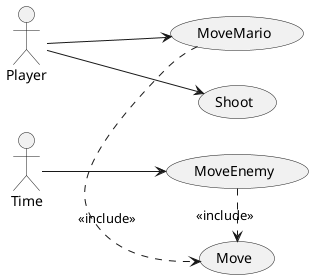

## Preguntas
* Si al activar el caso de uso `Move` hay una colisión que impide el movimiento, formaría parte del propio caso de uso `Move`, ya que forma parte de la misma conversación, ¿verdad? ¿Pasaría lo mismo con actualizar el marcador de monedas si al moverse y pasar por encima de una moneda, la recoge y aumenta su puntuación? ¿No quedaría un caso de uso enorme?
 * Que los enemigos se muevan, se actualice su posición y las monedas giren, se actualice su visualización. ¿Serian casos de uso del actor tiempo? ¿O más bien seria parte de la especificación de un caso de llamado `JugarNivel` o `Iniciar` que debería crear las monedas y mantenerlas en un bucle para ir rotándolas?

