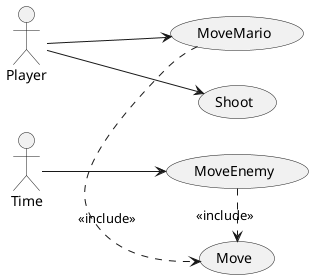

## Preguntas
* Si al activar el caso de uso `Move` hay una colision que impide el movimiento, formaria parte del propio caso de uso `Move` ya que forma parte de la misma conversacion, ¿verdad?
 * Que los enemigos se muevan, las monedas giren, ¿serian casos de uso del actor tiempo? 
